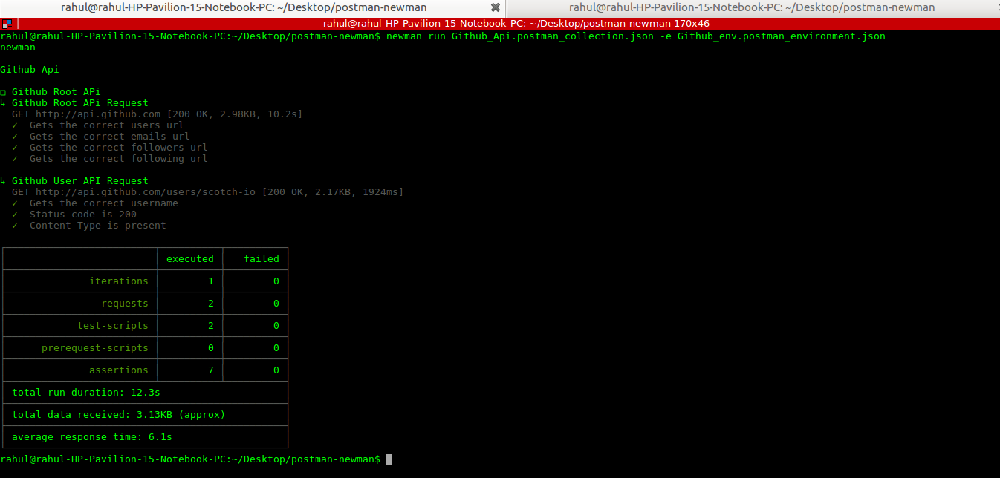

# postman-newman

Write API Tests with Postman and Newman

## Postman

1. Postman is a good tool which we mostly use to quickly test APIs to see the result returned by them, but it's actually way more powerful than that.
2. Making API is hard but Postman makes it simpler,easier.
3. You can simply test any API and see the response immediately.
4. You can create a collection of API endpoints and call them whenever you want to see the responses.

## Newman

1. We Write Tests in Postman, then export the collection and use Newman to run them directly from the command-line.

## Install Newman

```
npm i newman -g
```

# Command-Line Interface

 ```
 newman run Collection_fileName.json -e Enviornment_fileName.json 
 ```
 

